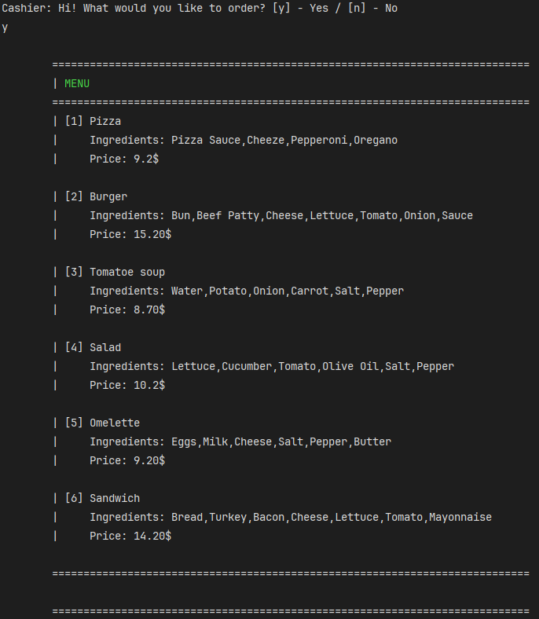
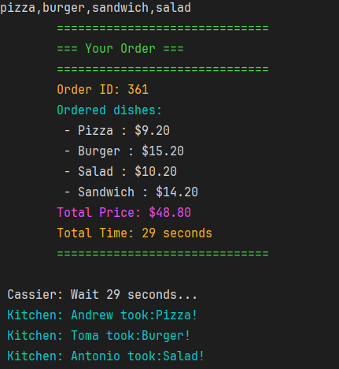
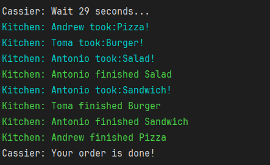

Console Food Ordering App

This is a simple console application that simulates ordering food from a cashier.

The program greets the user and shows a menu with different meals.  
Each item includes a name, list of ingredients, and price.  
The user can interact with the system by answering and choosing options.

The application demonstrates basic user interaction through the console and structured menu output.

Screenshots of the application can be found in the screenshots folder.

Screenshots

